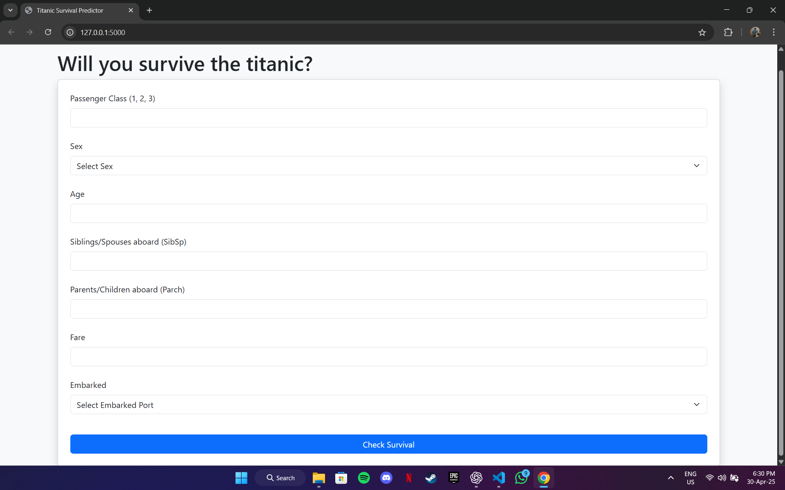
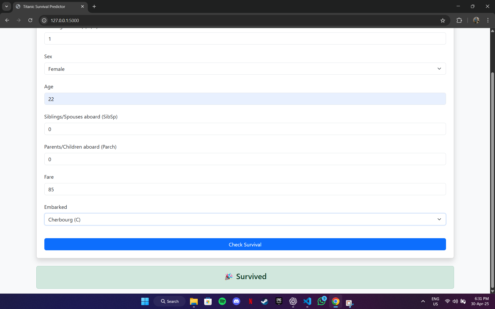

# 🚢 Titanic Survival Predictor 5000

Hey there! 👋  
This is a fun little ML + Flask project I built to predict whether someone would've survived the Titanic — based on real passenger data.  
I wanted to combine machine learning with a clean, minimal web interface. So here's what I came up with.

---

## 💡 What it does

- You enter passenger details (like age, gender, class, fare, etc.)
- My trained logistic regression model predicts if they’d survive or not
- The result shows up instantly — styled using Bootstrap with proper feedback

---

## 🧠 What I used

- **Python** – for data handling and model training
- **Pandas** + **scikit-learn** – to train the model (~81% accuracy)
- **Flask** – for the web app
- **Bootstrap 5** – to make it look clean and usable
- **Jinja2** – for rendering HTML dynamically
- **Pickle** – to load the trained model instantly

---

## 🖼️ Screenshots

| Form View | Prediction Result |
|-----------|-------------------|
|  |  |

---

## 🔧 How to run it locally

If you want to try it out:

1. **Clone the repo**
   ```bash
   git clone https://github.com/Jsps07/titanic-predictor
   cd titanic-predictor

2. **Create a virtual environment**
    ```bash
    python -m venv venv
    venv\Scripts\activate


3. **Install the libraries**
    ```bash
    pip install -r requirements.txt

4. **Run the app**
    ```bash
    python app.py

Then open your browser and go to http://127.0.0.1:5000

🧪 Model Details
    Logistic Regression trained on Kaggle’s Titanic dataset
    Cleaned missing values, encoded features, removed noise
    Accuracy: ~81%
    Live prediction using .pkl file (no retraining every time)

🙋 Why I built this
    This was my first full ML-to-web deployment project.
    It helped me solidify:
        how ML models are trained and saved
        how to build real-world Flask apps
        how to think like a developer, not just a student

🚀 Next steps
I plan to:
    host this on Render
    maybe add confidence % scores
    and of course, use it as a starter template for future ML apps!

🤝 Wanna connect?
    If you liked this, feel free to check out my other stuff or drop me a message.
    I’m currently learning full-time and aiming for an AI/ML co-op in Fall 2025 🙌